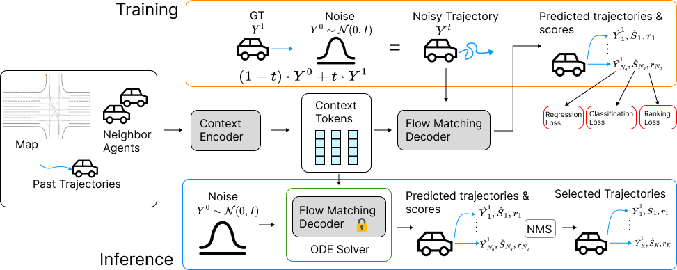

# TrajFlow: Multi-modal Motion Prediction via Flow Matching

[](https://www.arxiv.org/abs/2506.08541)
[](https://traj-flow.github.io/)

The official PyTorch implementation of IROS'25 paper named "TrajFlow: Multi-modal Motion Prediction via Flow Matching".

## Overview


We propose a new flow matching framework to predict multi-modal trajectories on the large-scale Waymo Open Motion Dataset.

## Install Python Environment

**Step 1:** Create a python environment

```bash
conda create --name trajflow python=3.10 -y
conda activate trajflow 
```

Please note that we use `python=3.10` mainly for compatibility with the `waymo-open-dataset-tf-2-12-0` package, which is required for metrics evaluation.

**Step 2:** Install the required packages

```bash
# install pytorch
## [cuda 11.8]
# conda install pytorch==2.2.0 torchvision==0.17.0 torchaudio==2.2.0 pytorch-cuda=11.8 -c pytorch -c nvidia
pip install torch==2.2.0 torchvision==0.17.0 torchaudio==2.2.0 --index-url https://download.pytorch.org/whl/cu118

# install waymo helper
pip install waymo-open-dataset-tf-2-12-0

# install other packages
pip install -r setup/requirements.txt
```

**Step 3:** Compile CUDA code

```bash
conda install git
conda install -c conda-forge ninja

# we use compute nodes with CUDA 11.8
python setup/setup_trajflow.py develop

# if you don't have CUDA 11.8 installed, you can use the following command to install it
# ref: https://stackoverflow.com/questions/67483626/setup-tensorflow-2-4-on-ubuntu-20-04-with-gpu-without-sudo
mkdir -p cuda_toolkits/cuda-11.8 && mkdir -p tmp
wget https://developer.download.nvidia.com/compute/cuda/11.8.0/local_installers/cuda_11.8.0_520.61.05_linux.run
bash ./cuda_11.8.0_520.61.05_linux.run --silent --tmpdir=$(pwd)/tmp --toolkit --toolkitpath=$(pwd)/cuda_toolkits/cuda-11.8
rm -rf tmp
export CUDA11=$(pwd)/cuda_toolkits/cuda-11.8
export PATH=$CUDA11/bin:$PATH
export LD_LIBRARY_PATH=$CUDA11/lib64:$CUDA11/extras/CUPTI/lib64:$LD_LIBRARY_PATH
export TORCH_CUDA_ARCH_LIST="7.0;7.5;8.0;8.6+PTX"
python setup/setup_trajflow.py develop
```

Finally, run the following for sanity check:

```bash
python -c "import torch; import trajflow; print(torch.__version__, trajflow.__file__, 'pytorch sanity check pass'); "
python -c "from waymo_open_dataset.metrics.ops import py_metrics_ops; print('waymo metrics sanity check pass'); "
```

## Waymo Dataset Preparation

**Step 1:** Download Waymo Open Motion Dataset `v1.3.0` from the [official website](https://waymo.com/open/download/) at `waymo_open_dataset_motion_v_1_3_0/uncompressed/scenario`, and organize the data as follows:

```bash
├── data
│   ├── waymo
│   │   ├── scenario
│   │   │   ├──training
│   │   │   ├──validation
│   │   │   ├──testing
├── ...
```

**Step 2:** Preprocess the dataset:

```bash
cd trajflow/datasets/waymo
python data_preprocess.py ../../../data/waymo/scenario/  ../../../data/waymo
```

The processed data will be saved to `data/waymo/` directory as follows:

```bash
├── data
│   ├── waymo
│   │   ├── processed_scenarios_training
│   │   ├── processed_scenarios_validation
│   │   ├── processed_scenarios_testing
│   │   ├── processed_scenarios_validation_interactive
│   │   ├── processed_scenarios_testing_interactive
│   │   ├── processed_scenarios_training_infos.pkl
│   │   ├── processed_scenarios_val_infos.pkl
│   │   ├── processed_scenarios_test_infos.pkl
│   │   ├── processed_scenarios_val_inter_infos.pkl
│   │   ├── processed_scenarios_test_inter_infos.pkl
├── ...
```

We use the clustering result from [MTR](https://github.com/sshaoshuai/MTR) for intention points, which is saved in `data/waymo/cluster_64_center_dict.pkl`.

## Training and Evaluation

```bash
## setup wandb credentials
wandb login

## training
cd runner
bash scripts/dist_train.sh 4 --cfg_file cfgs/waymo/trajflow+100_percent_data.yaml --epoch 40 --batch_size 80 --extra_tag trajflow --max_ckpt_save_num 100 --ckpt_save_interval 1

## evaluation
### validation set
python test.py --batch_size 64 --extra_tag=$(hostname) \
--ckpt ${PATH_TO_CKPT} \
--val --full_eval

### testing set (for submission)
python test.py --batch_size 64 --extra_tag=$(hostname) \
--ckpt ${PATH_TO_CKPT} \
--test --full_eval --submit --email ${EMAIL}  --method_nm ${METHOD_NAME}
```

## Acknowledgment and Contact

We would like to thank the [MTR](https://github.com/sshaoshuai/MTR) and [BeTopNet](https://github.com/OpenDriveLab/BeTop) repositories for their open-source codebase.

If you have any questions, please contact [Qi Yan](mailto:qi.yan@ece.ubc.ca).

## Citation

If you find this work useful, please consider citing:

```bibtex
@article{yan2025trajflow,
      title={TrajFlow: Multi-modal Motion Prediction via Flow Matching},
      author={Yan, Qi and Zhang, Brian and Zhang, Yutong and Yang, Daniel and White, Joshua and Chen, Di and Liu, Jiachao and Liu, Langechuan and Zhuang, Binnan and Shi, Shaoshuai and others},
      journal={arXiv preprint arXiv:2506.08541},
      year={2025}
    }
```
